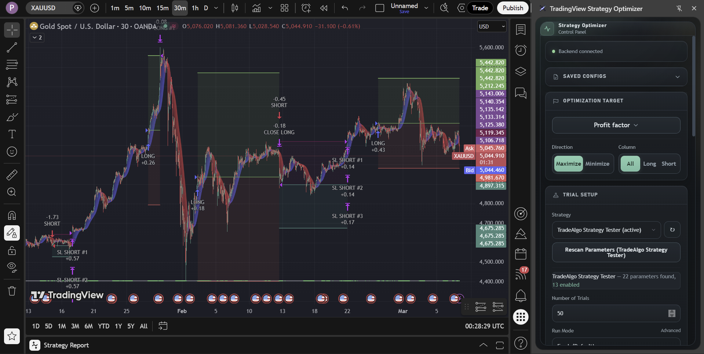
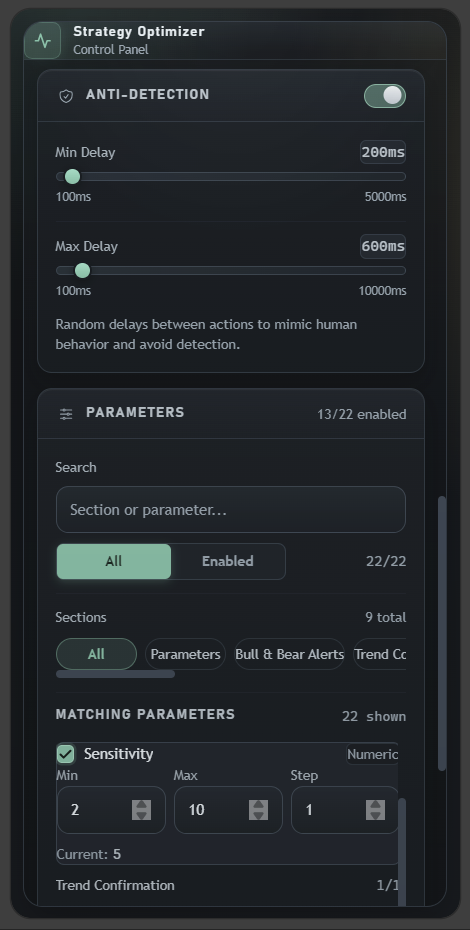
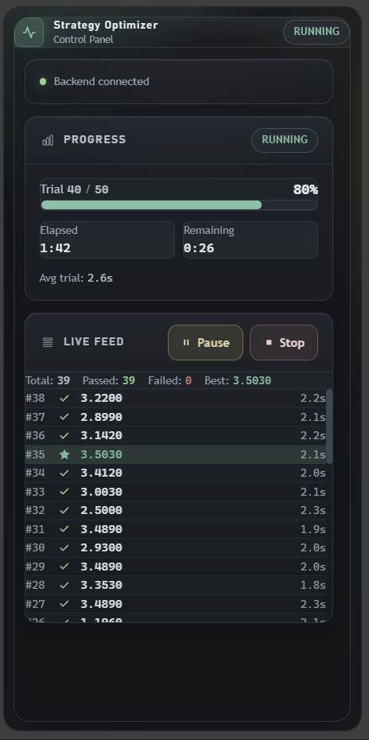
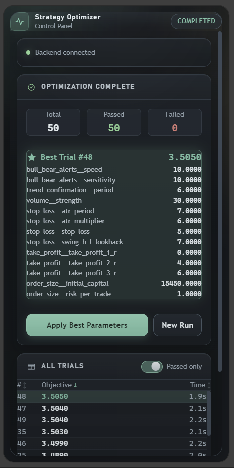

# TradingView Strategy Optimizer

A Chrome extension and local Python backend that optimizes TradingView strategy parameters using [Optuna](https://optuna.org/)-powered Bayesian optimization. The extension runs as a side panel on TradingView chart pages, communicates with a local FastAPI backend over WebSocket, and iteratively tunes your strategy inputs to find optimal parameter combinations.

<p align="center">
  
</p>

## Prerequisites

- **Python** ≥ 3.12, < 3.14
- **Node.js** ≥ 20.19.0, < 25
- **[uv](https://docs.astral.sh/uv/)** — fast Python package/project manager
- **npm** ≥ 10
- **PowerShell 7+** (`pwsh`) — used by the helper scripts

## Quick start

Start both the backend and the extension dev server in one command:

```powershell
pwsh -File scripts/dev.ps1
```

Then load the extension in Chrome:

1. Go to `chrome://extensions` and enable **Developer mode**.
2. Click **Load unpacked** and select the `extension/dist` folder.
3. Open a TradingView chart and click the extension icon to open the side panel.

## Manual setup

### Backend

```bash
# Install dependencies
uv sync --frozen --project backend

# Run the server
uv run --project backend uvicorn backend.main:app --host 127.0.0.1 --port 8765 --reload
```

### Extension

```bash
cd extension
npm ci
npm run dev
```

### Optional backend extras

```bash
# AutoSampler (installs optunahub, scipy, torch, and cmaes)
uv sync --frozen --project backend --extra auto-sampler

# Gaussian Process sampler (installs scipy and torch)
uv sync --frozen --project backend --extra sampler-gp

# CMA-ES sampler (installs cmaes)
uv sync --frozen --project backend --extra sampler-cmaes
```

> If `auto-sampler` is not installed, `sampler=auto` falls back to deterministic TPE.

## Scripts

| Script | Purpose |
|---|---|
| `pwsh -File scripts/dev.ps1` | Launch backend + extension dev server |
| `pwsh -File scripts/check.ps1` | Run all linting, type-checking, tests, and audits for both backend and extension |

## Extension commands

```bash
cd extension
npm run dev             # Vite dev server with HMR
npm run build           # Production build
npm run typecheck       # TypeScript type-check
npm run lint            # ESLint (zero warnings)
npm run lint:fix        # ESLint with auto-fix
npm run test            # Vitest tests
npm run format          # Prettier format
npm run format:check    # Prettier check
npm run ci              # Full CI suite (typecheck + lint + test + audit)
```

## Backend commands

```bash
# Linting
uv run --project backend --extra dev ruff check --config backend/pyproject.toml backend

# Type-checking
uv run --project backend --extra dev pyright -p backend/pyrightconfig.json backend

# Tests
uv run --project backend --extra dev python -m pytest -q backend/tests
```

## Project structure

```
├── backend/                Python backend (FastAPI + Optuna)
│   ├── main.py             WebSocket server & API endpoints
│   ├── optimizer.py        Optuna ask-and-tell optimizer wrapper
│   ├── models.py           Pydantic message schemas
│   ├── data/               SQLite study storage (git-ignored)
│   ├── tests/              Backend tests
│   └── pyproject.toml      Python dependencies & config
├── extension/              Chrome extension (React + Vite)
│   ├── src/
│   │   ├── manifest.json   MV3 extension manifest
│   │   ├── background/     Service worker
│   │   ├── content/        Content script (TradingView pages)
│   │   ├── sidepanel/      React side panel UI
│   │   ├── shared/         Shared types/utilities
│   │   └── utils/          Utility modules
│   ├── package.json        Node dependencies & scripts
│   └── vite.config.ts      Vite + CRXJS config
└── scripts/                PowerShell helper scripts
```

## How it works

1. The **content script** injects into TradingView chart pages and interacts with the strategy tester UI.
2. The **side panel** provides the optimizer controls and connects to the backend via WebSocket (`ws://127.0.0.1:8765`).
3. The **backend** manages Optuna studies with an ask-and-tell loop — it suggests parameter combinations, receives performance results, and converges toward optimal values.
4. Studies are persisted locally as SQLite databases in `backend/data/`.

<table align="center">
  <tr>
    <td align="center" valign="top"></td>
    <td align="center" valign="top"></td>
    <td align="center" valign="top"></td>
  </tr>
</table>

## Supported samplers

| Sampler | Extra required | Description |
|---|---|---|
| `tpe` | — | Tree-structured Parzen Estimator (default) |
| `random` | — | Random sampling |
| `qmc` | — | Quasi-Monte Carlo |
| `auto` | `auto-sampler` | OptunaHub AutoSampler (falls back to TPE if not installed) |
| `gp` | `sampler-gp` | Gaussian Process (installs `scipy` and `torch`) |
| `cmaes` | `sampler-cmaes` | CMA-ES evolutionary strategy (installs `cmaes`) |

## License

This project is licensed under the [GNU General Public License v3.0](LICENSE).

---

**Disclaimer:** This software is provided for research and educational purposes only. The author is not responsible for financial losses resulting from the use of this software.